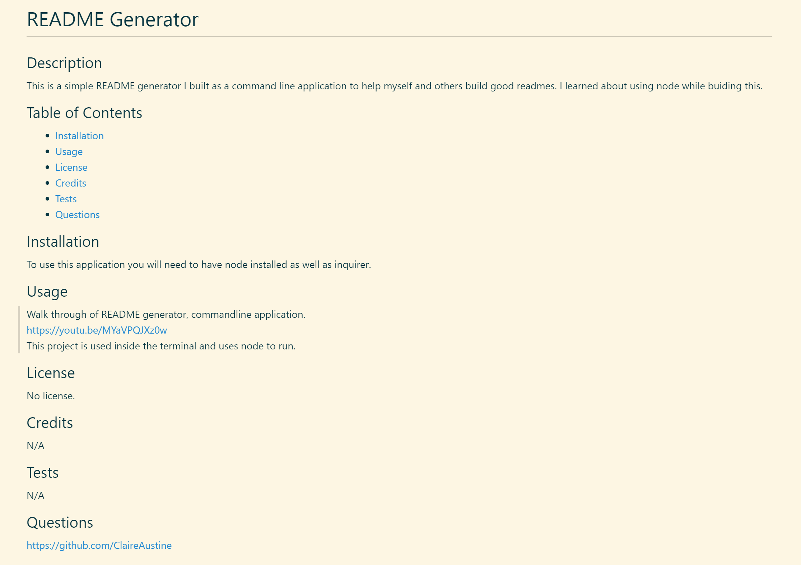

# README Generator

## Description

This is a simple README generator I built as a command line application to help myself and others build good readmes. I learned about using node while buiding this.

## Table of Contents

- [Installation](#installation)
- [Usage](#usage)
- [License](#license)
- [Credits](#credits)
- [Tests](#tests)
- [Questions](#questions)

## Installation

To use this application you will need to have node installed as well as inquirer.

## Usage

Walk through of README generator, commandline application.  
https://youtu.be/MYaVPQJXz0w   
This project is used inside the terminal and uses node to run.
Example of a generated README 

## License

No license.

## Credits

N/A

## Tests

N/A

## Questions

https://github.com/ClaireAustine
